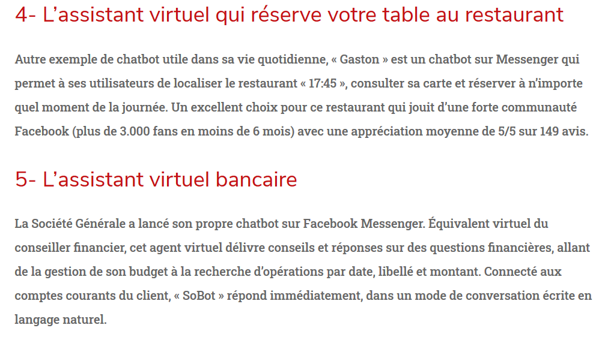

([Retour à l'accueil](https://sylviehannon.github.io/chatbot/))
1. [Définitions](definitions.md)
2. [Historique](historique.md)
3. [Fonctionnement](fonctionnement.md)
4. [Applications](applications.md)
      1. **Commerciales**
      2. [Médicales](amedicales.md)
      3. [Dans la vie quotidienne](aquoti.md)
      4. [Dans la fiction](afictions.md)

## Les chatbots : applications commerciales

L'une des premières applications à laquelle on pense, concernant les chatbots, c'est bien évidemment l'utilisation commerciales : nous avons déjà tous vu les eptites bulles de discussion automatiques apparaître dans un coin de notre écran durant des séances de shopping en ligne. Mais les chabots commerciaux ne se limitent pas à cela...

CONVERSATIONNEL. « Quels sont les différents types de chatbots ? » [en ligne]. In *Conversationnel*. Publié le 28 janvier 2020 [consulté le 28 mai 2020]. Disponible sur le Web : <[https://www.conversationnel.fr/chatbot/quels-sont-les-differents-types-de-chatbots/](https://www.conversationnel.fr/chatbot/quels-sont-les-differents-types-de-chatbots/)>

---
Souvent liés à la vie quotidienne, certains bots proposent de **faciliter** la vie des consommateurs tout en les fidélisant.

BOB LE BOT. « Quels sont les différents types de chatbots ? » [en ligne]. In *Bob le bot*. Publié le 19 novembre 2018 [consulté le 12 juin 2020]. Disponible sur le Web : <[https://www.bob-le-bot.fr/blog/exemples-chatbots-qui-marchent/](https://www.bob-le-bot.fr/blog/exemples-chatbots-qui-marchent/)>
