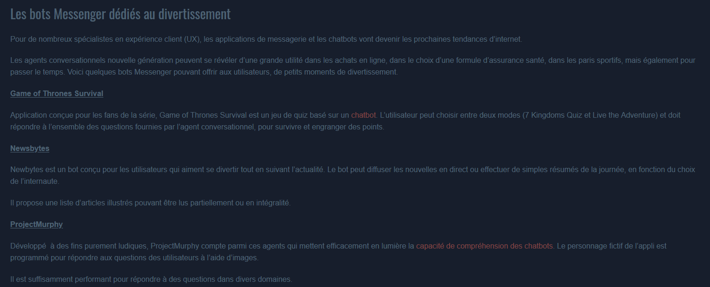

([Retour à l'accueil](https://sylviehannon.github.io/chatbot/))
1. [Définitions](definitions.md)
2. [Historique](historique.md)
3. [Fonctionnement](fonctionnement.md)
4. [Applications](applications.md)
      1. [Commerciales](acommerciales.md)
      2. [Médicales](amedicales.md)
      3. [Dans la vie quotidienne](aquoti.md)
      4. **Divertissement et jeux**

## Les chatbots : utilisés dans les jeux et le divertissement

INTELLIGENCE ARTIFICIELLE. « Les chatbots dans les jeux » [en ligne]. In *Intelligence Artificielle*. [s. d.] [consulté le 12 juin 2020]. Disponible sur le Web : <[http://intelligence-artificielle1.e-monsite.com/pages/chatbots-monde-jeux.html](http://intelligence-artificielle1.e-monsite.com/pages/chatbots-monde-jeux.html)>

CHATBOT PACK. « Introduction to Discord bots » [en ligne]. In *Chatbot Pack*. Mis à jour le 22 juillet 2019 [consulté le 12 juin 2020]. Disponible sur le Web : <[https://www.chatbotpack.com/discord-bots](https://www.chatbotpack.com/discord-bots)>
