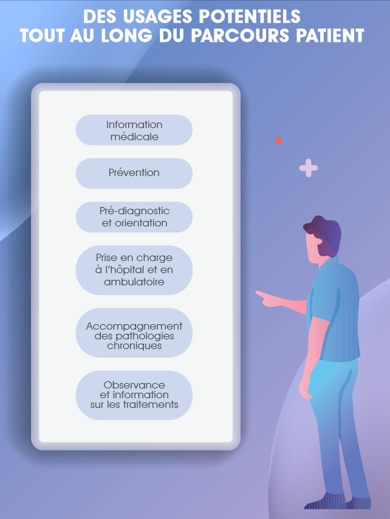
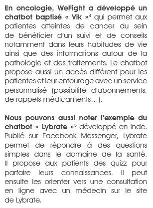
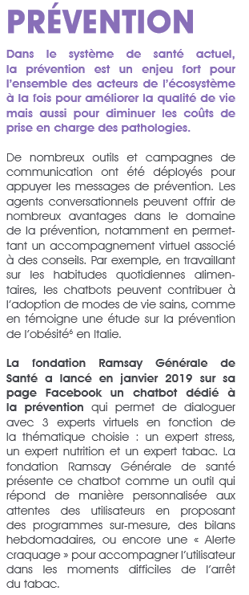
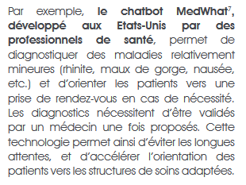
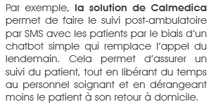
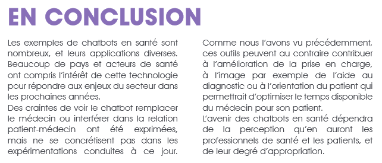
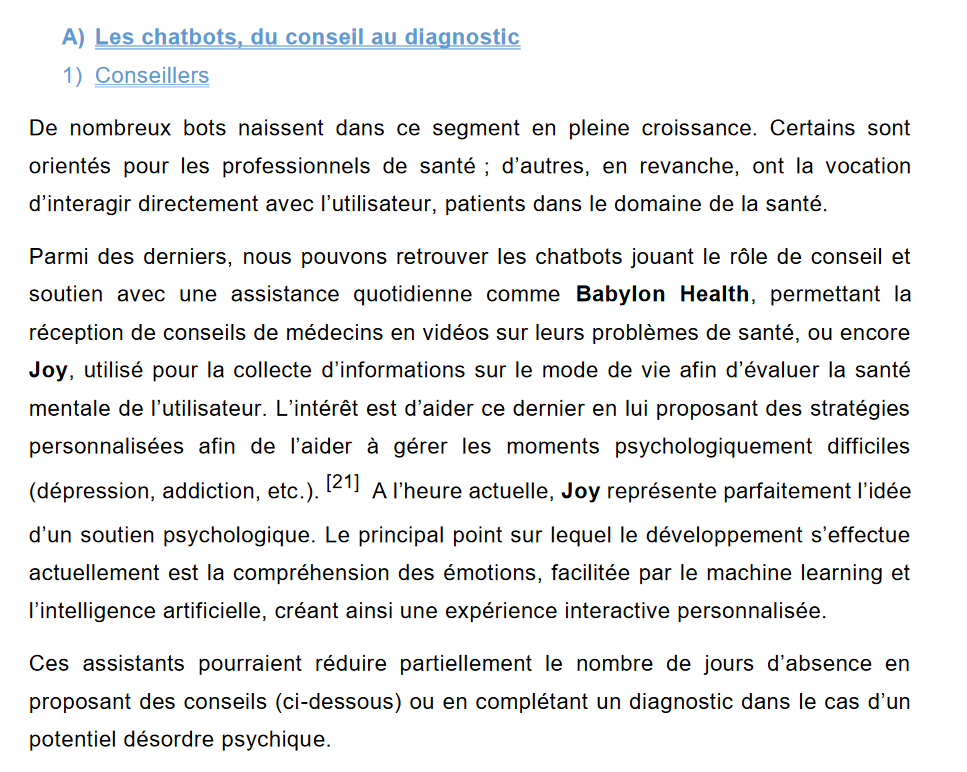
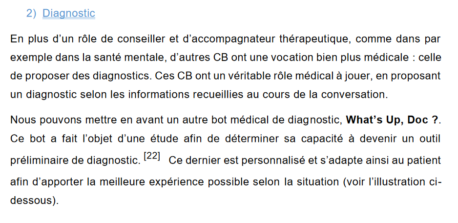

([Retour à l'accueil](https://sylviehannon.github.io/chatbot/))
1. [Définitions](definitions.md)
2. [Historique](historique.md)
3. [Fonctionnement](fonctionnement.md)
4. [Applications](applications.md)
      1. [Commerciales](acommerciales.md)
      2. **Médicales**
      3. [Dans la vie quotidienne](aquoti.md)
      4. [Divertissement et jeux](afictions.md)

## Les chatbots : utilisations dans le domaine médical

## DIAGNOSTIC ET ORIENTATION

### PRISE EN CHARGE À L’HÔPITAL ET EN AMBULATOIRE

FRANCE. SANOFI. « Les chatbots en santé » [en ligne]. In Sanofi. *Chatbot médical : défis techniques, enjeux éthiques*. Publié en juin 2019 [consulté le 26 mai 2020]. p. 25-31. Disponible sur le Web : <[https://www.sanofi.fr/fr/-/media/Project/One-Sanofi-Web/Websites/Europe/Sanofi-FR/Newsroom/nos-publications/Livre-blanc-BOT-V03_BD.pdf](https://www.sanofi.fr/fr/-/media/Project/One-Sanofi-Web/Websites/Europe/Sanofi-FR/Newsroom/nos-publications/Livre-blanc-BOT-V03_BD.pdf)>

---

VANHOUTTE, Rémi. *Chatbots en santé: opportunités de développement et bénéfices utilisateurs*. Mémoire de fin d’études de 2ème année de Master : Master Ingénierie et Management de la Santé : Lille, université de Lille 2 : 2018. p. 21-18. Disponible sur le Web : <[https://pepite-depot.univ-lille2.fr/nuxeo/site/esupversions/d8887798-b7e3-4622-b001-d6dec7175467](https://pepite-depot.univ-lille2.fr/nuxeo/site/esupversions/d8887798-b7e3-4622-b001-d6dec7175467)>
