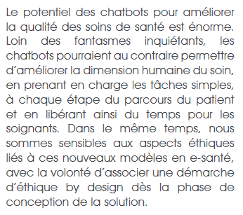

([Retour à l'accueil](https://sylviehannon.github.io/chatbot/))
1. [Définitions](definitions.md)
2. [Historique](historique.md)
3. [Fonctionnement](fonctionnement.md)
4. **Applications**
      1. [Commerciales](acommerciales.md)
      2. [Médicales](amedicales.md)
      3. [Dans la vie quotidienne](aquoti.md)
      4. [Dans la fiction](afictions.md)

## Les chatbots : divers types d'application

VALENTINE. « Les chatbots : avantages et bonnes pratiques en BtoB » [en ligne]. In *Neoptimal*. Publié le 10 mai 2019 [consulté le 28 mai 2020]. Disponible sur le Web : <[https://www.neoptimal.com/blog/les-chatbots-avantages-et-bonnes-pratiques-en-btob](https://www.neoptimal.com/blog/les-chatbots-avantages-et-bonnes-pratiques-en-btob)>

## Utilisations commerciales

Plus d'informations sur les [applications commerciales](acommerciales.md) des chatbots

## Utilisations dans le domaine médical

FRANCE. SANOFI. « Les chatbots en santé » [en ligne]. In Sanofi. *Chatbot médical : défis techniques, enjeux éthiques*. Publié en juin 2019 [consulté le 26 mai 2020]. Disponible sur le Web : <[https://www.sanofi.fr/fr/-/media/Project/One-Sanofi-Web/Websites/Europe/Sanofi-FR/Newsroom/nos-publications/Livre-blanc-BOT-V03_BD.pdf](https://www.sanofi.fr/fr/-/media/Project/One-Sanofi-Web/Websites/Europe/Sanofi-FR/Newsroom/nos-publications/Livre-blanc-BOT-V03_BD.pdf)>

Plus d'informations sur les [applications commerciales](amedicales.md) des chatbots

## Utilisations dans la vie quotidienne

Plus d'informations sur les [applications dans la vie quotidienne](aquoti.md) des chatbots

## Utilisations dans la fiction

Plus d'informations sur la [fiction](afictions.md) des chatbots
