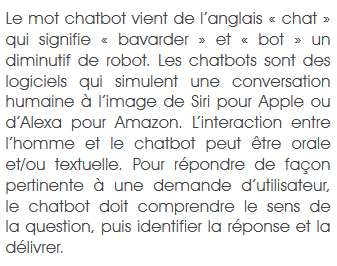

([Retour à l'accueil](https://sylviehannon.github.io/chatbot/))
1. **Définitions**
2. [Historique](historique.md)
3. [Fonctionnement](fonctionnement.md)
4. [Applications](applications.md)
      1. [Commerciales](acommerciales.md)
      2. [Médicales](amedicales.md)
      3. [Dans la vie quotidienne](aquoti.md)
      4. [Dans la fiction](afictions.md)

## Les chatbots : définitions

Vous trouverez ici quelques définitions sur ce qu'est un **chatbot**.

BATHELOT, Bertrand. « Chatbot » [en ligne]. In *Définitions marketing*. Mis à jour le 20 janvier 2020 [consulté le 26 mai 2020]. Disponible sur le Web : <[https://www.definitions-marketing.com/definition/chatbot/](https://www.definitions-marketing.com/definition/chatbot/)>

---

FRANCE. SANOFI. « Les chatbots en santé » [en ligne]. In Sanofi. *Chatbot médical : défis techniques, enjeux éthiques*. Publié en juin 2019 [consulté le 26 mai 2020]. Disponible sur le Web : <[https://www.sanofi.fr/fr/-/media/Project/One-Sanofi-Web/Websites/Europe/Sanofi-FR/Newsroom/nos-publications/Livre-blanc-BOT-V03_BD.pdf](https://www.sanofi.fr/fr/-/media/Project/One-Sanofi-Web/Websites/Europe/Sanofi-FR/Newsroom/nos-publications/Livre-blanc-BOT-V03_BD.pdf)>

---

HENRY, Clémentine-Lou. « Chatbot et Agent conversationnel » [en ligne]. In *DigitaWeb*. [s. d.] [consulté le 26 mai 2020]. Disponible sur le Web : <[https://www.digitaweb.com/blog/chatbot-definition](https://www.digitaweb.com/blog/chatbot-definition)>

---

De manière plus humoristique, un site propose une définition du chatbot "adaptée à mamie".

LAW-WAI, Léa. « Le Chatbot expliqué à ma grand-mère » [en ligne]. In *Marketing Management*. Publié le 24 février 2020 [consulté le 26 mai 2020]. Disponible sur le Web : <[https://blog.marketing-management.io/chatbot-definition](https://blog.marketing-management.io/chatbot-definition)>
