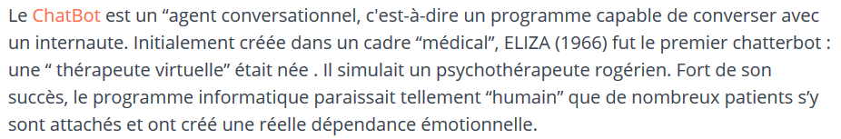
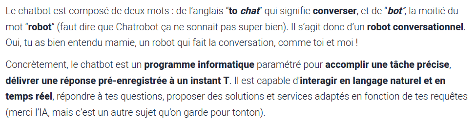

([Retour à l'accueil](https://sylviehannon.github.io/chatbot/))
1. **Définitions**
2. [Historique](historique.md)
3. [Applications](applications.md)
      1. [Commerciales](acommerciales.md)
      2. [Médicales](amedicales.md)
      3. [Fictionnelles](afictions.md)

## Les chatbots : définitions

BATHELOT, Bertrand. « Chatbot » [en ligne]. In *Définitions marketing*. Mis à jour le 20 janvier 2020 [consulté le 26 mai 2020]. Disponible sur le Web : <[https://www.definitions-marketing.com/definition/chatbot/](https://www.definitions-marketing.com/definition/chatbot/)>

HENRY, Clémentine-Lou. « Chatbot et Agent conversationnel » [en ligne]. In *DigitaWeb*. [s. d.] [consulté le 26 mai 2020]. Disponible sur le Web : <[https://www.digitaweb.com/blog/chatbot-definition](https://www.digitaweb.com/blog/chatbot-definition)>

De manière plus humoristique, un site propose une définition du chatbot "adaptée à mamie".

LAW-WAI, Léa. « Le Chatbot expliqué à ma grand-mère » [en ligne]. In *Marketing Management*. Publié le 24 février 2020 [consulté le 26 mai 2020]. Disponible sur le Web : <[https://blog.marketing-management.io/chatbot-definition](https://blog.marketing-management.io/chatbot-definition)>
