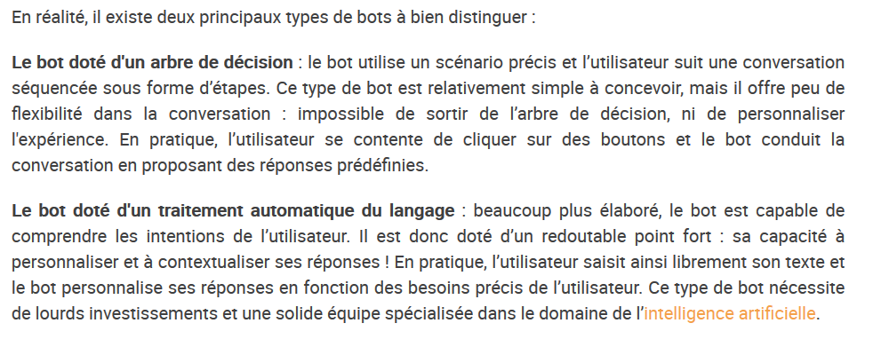
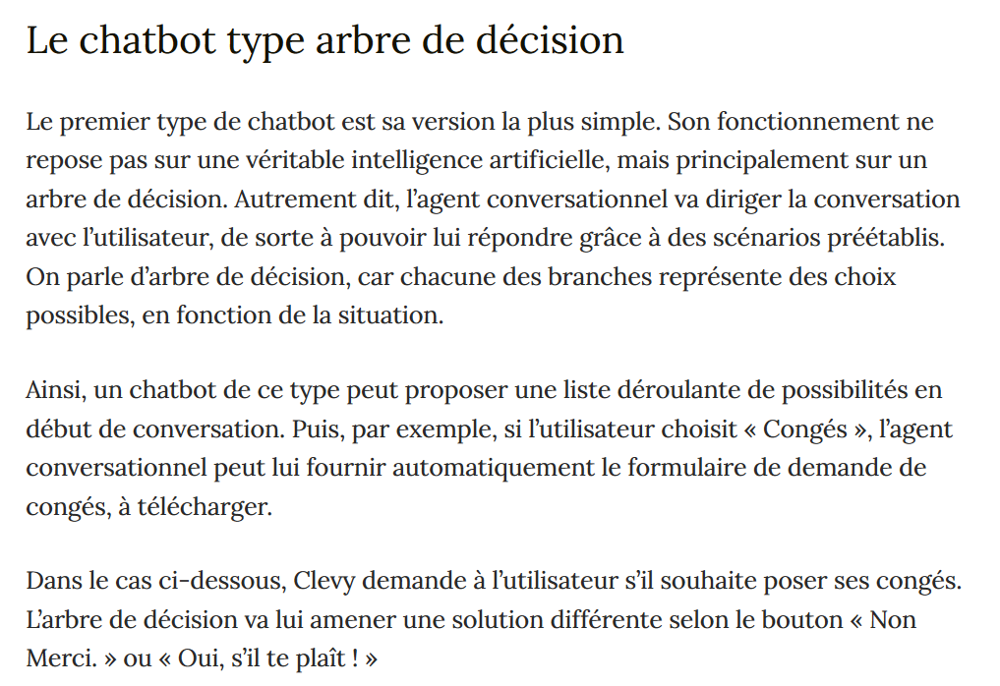
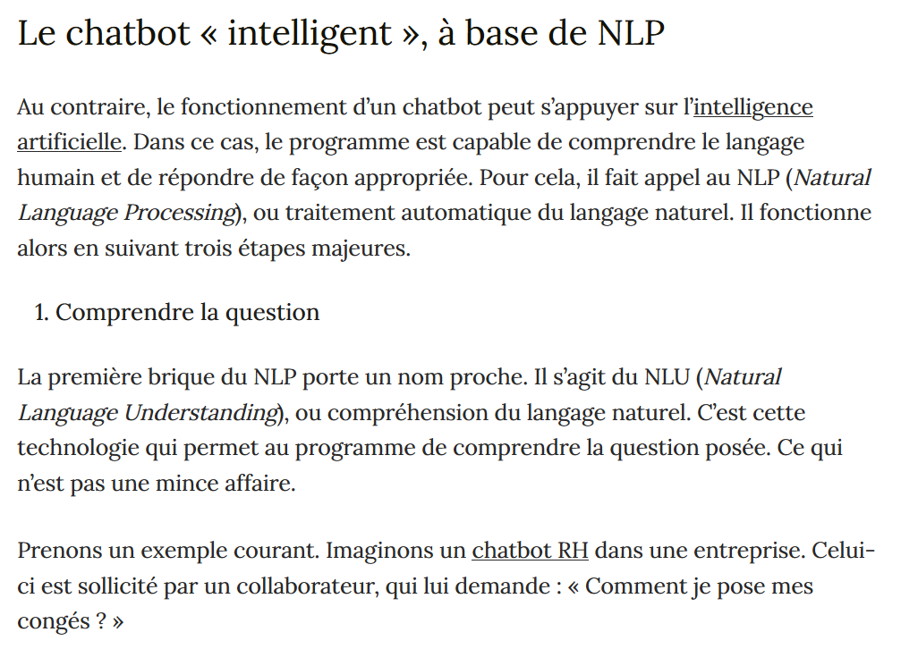
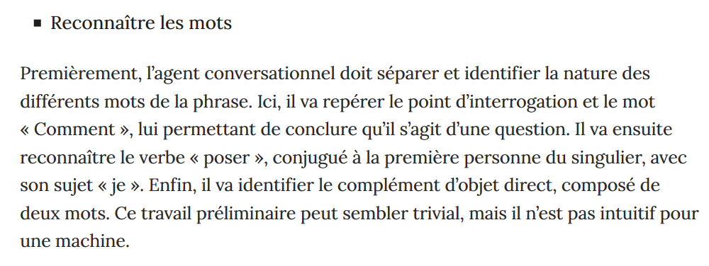
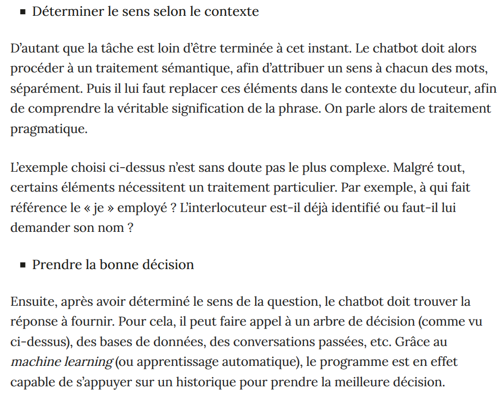
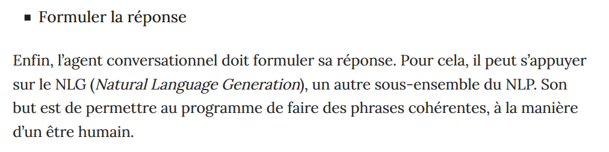

([Retour à l'accueil](https://sylviehannon.github.io/chatbot/))
1. [Définitions](definitions.md)
2. [Historique](historique.md)
3. **Fonctionnement**
4. [Applications](applications.md)
      1. [Commerciales](acommerciales.md)
      2. [Médicales](amedicales.md)
      3. [Dans la vie quotidienne](aquoti.md)
      4. [Dans la fiction](afictions.md)
      
## Les chatbots : fonctionnement

Vous trouverez ici des références concernant le fonctionnement des chatbots.
      
  
KOKOROE. « L'ère de la chatbot mania... » [en ligne]. In *Kokoroe*. [s. d.] [consulté le 11 juin 2020]. Disponible sur le Web : <[https://www.kokoroe.fr/list/competences-humaines/article/l-ere-de-la-chatbot-mania-1236](https://www.kokoroe.fr/list/competences-humaines/article/l-ere-de-la-chatbot-mania-1236)>

---

BASTIEN. « Comprendre le fonctionnement d’un assistant conversationnel » [en ligne]. In *Clevy*. Mis à jour le 15 novembre 2019 [consulté le 12 juin 2020]. Disponible sur le Web : <[https://blog.clevy.io/conversationnel/comprendre-le-fonctionnement-dun-chatbot/](https://blog.clevy.io/conversationnel/comprendre-le-fonctionnement-dun-chatbot/)>
