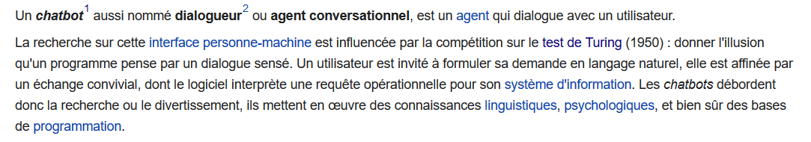
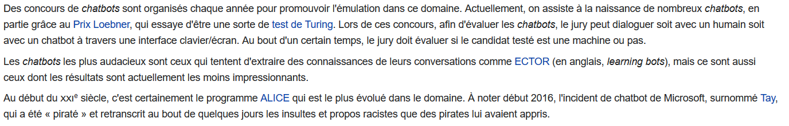
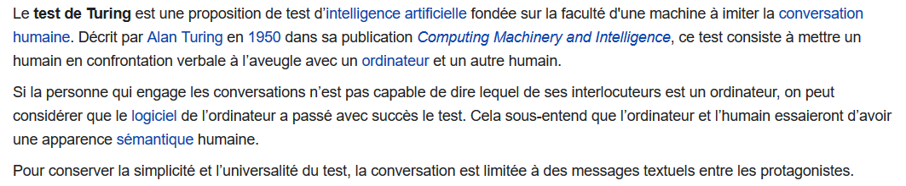
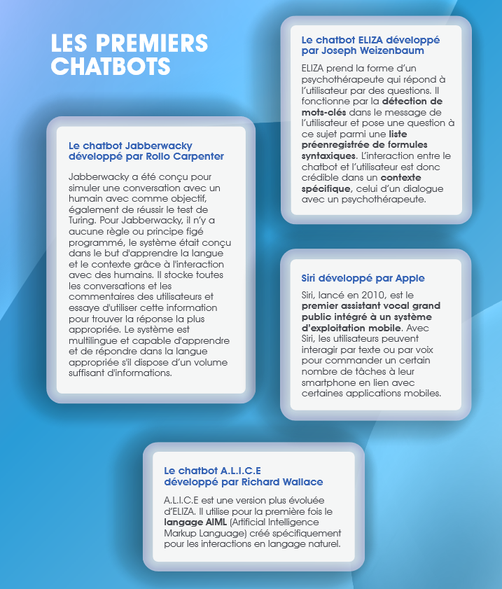
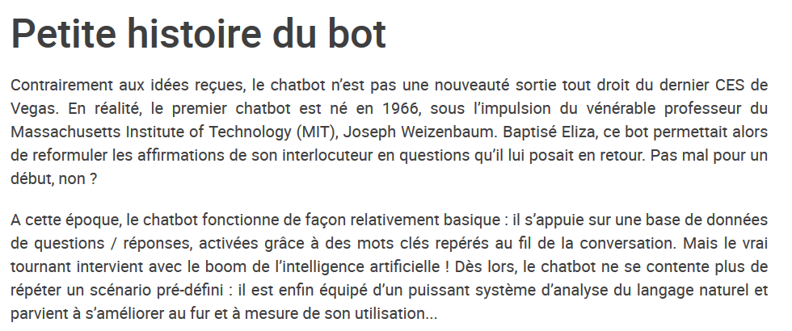

([Retour à l'accueil](https://sylviehannon.github.io/chatbot/))
1. [Définitions](definitions.md)
2. **Historique**
3. [Fonctionnement](fonctionnement.md)
4. [Applications](applications.md)
      1. [Commerciales](acommerciales.md)
      2. [Médicales](amedicales.md)
      3. [Dans la vie quotidienne](aquoti.md)
      4. [Divertissement et jeux](afictions.md)
      
## Les chatbots : historique

Vous trouverez ici des références concernant l'histoire des chatbots, des premiers prototypes aux modèles plus avancés d'aujourd'hui.

COLLECTIF. « Chatbot » [en ligne]. In *Wikipédia*. Mis à jour le 19 mai 2020 [consulté le 26 mai 2020]. Disponible sur le Web : <[https://fr.wikipedia.org/wiki/Chatbot](https://fr.wikipedia.org/wiki/Chatbot)>

---

COLLECTIF. « Test de Turing » [en ligne]. In *Wikipédia*. Mis à jour le 29 mai 2020 [consulté le 10 juin 2020]. Disponible sur le Web : <[https://fr.wikipedia.org/wiki/Test_de_Turing](https://fr.wikipedia.org/wiki/Test_de_Turing)>

---

FRANCE. SANOFI. « Les chatbots en santé » [en ligne]. In Sanofi. *Chatbot médical : défis techniques, enjeux éthiques*. Publié en juin 2019 [consulté le 26 mai 2020]. p. 15. Disponible sur le Web : <[https://www.sanofi.fr/fr/-/media/Project/One-Sanofi-Web/Websites/Europe/Sanofi-FR/Newsroom/nos-publications/Livre-blanc-BOT-V03_BD.pdf](https://www.sanofi.fr/fr/-/media/Project/One-Sanofi-Web/Websites/Europe/Sanofi-FR/Newsroom/nos-publications/Livre-blanc-BOT-V03_BD.pdf)>

MY CHATBOT AGENCY « L'Histoire des Chatbots » [en ligne]. In *My chatbot agency*. Publié le 26 octobre 2018 [consulté le 27 mai 2020]. Disponible sur le Web : <[http://www.mychatbotagency.com/blog/histoire-chatbots/](http://www.mychatbotagency.com/blog/histoire-chatbots/)>

---

KOKOROE. « L'ère de la chatbot mania... » [en ligne]. In Kokoroe. [s. d.] [consulté le 26 mai 2020]. Disponible sur le Web : <[https://www.kokoroe.fr/list/competences-humaines/article/l-ere-de-la-chatbot-mania-1236](https://www.kokoroe.fr/list/competences-humaines/article/l-ere-de-la-chatbot-mania-1236)>
