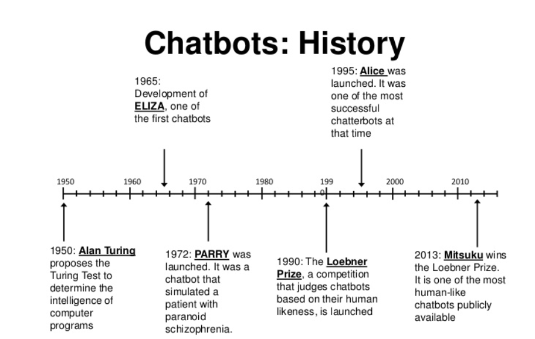
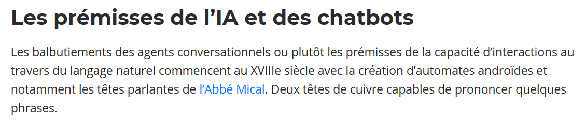
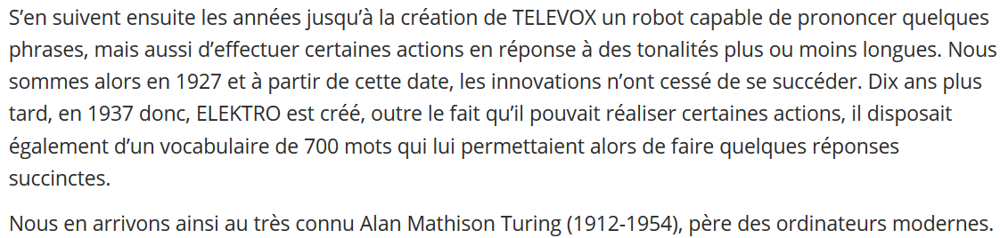

([Retour à l'accueil](https://sylviehannon.github.io/chatbot/))
1. [Définitions](definitions.md)
2. **Historique**
3. [Fonctionnement](fonctionnement.md)
4. [Applications](applications.md)
      1. [Commerciales](acommerciales.md)
      2. [Médicales](amedicales.md)
      3. [Fictionnelles](afictions.md)
      
## Les chatbots : historique

Vous trouverez ici des références concernant l'histoire des chatbots, des premiers prototypes aux modèles plus avancés d'aujourd'hui.

« L'Histoire des Chatbots » [en ligne]. In *My chatbot agency*. Publié le 26 octobre 2018 [consulté le 27 mai 2020]. Disponible sur le Web : <[http://www.mychatbotagency.com/blog/histoire-chatbots/](http://www.mychatbotagency.com/blog/histoire-chatbots/)>

---
